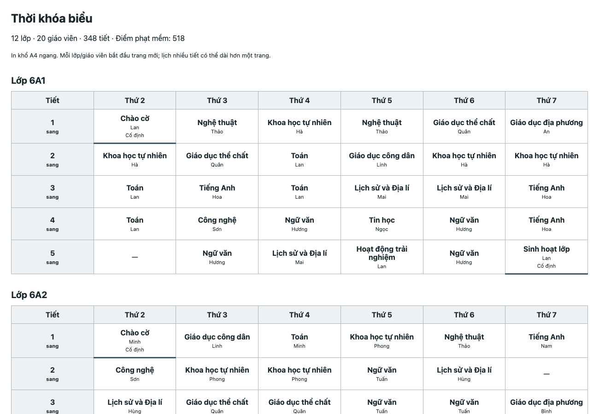

# mona-thoi-khoa-bieu

[](LICENSE)
[](https://www.npmjs.com/package/mona-thoi-khoa-bieu)

Thư viện TypeScript xếp thời khóa biểu tuần cho trường học và trung tâm Việt Nam, giữ đủ số tiết, không trùng lớp/GV, có lịch bận và tiết cố định.

Không có dependency runtime. Chạy trên Node.js ≥18 hoặc trình duyệt; xuất JSON, CSV mở bằng Excel và HTML in A4 ngang.

```text
Đã xếp 348 tiết cho 12 lớp, 20 GV.
Điểm phạt mềm: 518; 113 mục còn lại.
Kết quả: …/ketqua/thcs

✓ Đủ số tiết theo phân công
✓ Không trùng giáo viên/lớp, không trùng giờ bận
✓ Chào cờ thứ 2 tiết 1; Sinh hoạt lớp thứ 7 tiết 5
```



Đây là output mẫu của `examples/thcs/input.json`, seed 42, mặc định 2.500 lượt tối ưu. Điểm mềm có thể khác nếu thời gian chạy bị cắt ngắn. Không cần tài khoản hay dịch vụ bên ngoài.

## Cài đặt

Sau khi gói được phát hành lên npm:

```sh
npm i mona-thoi-khoa-bieu
```

```sh
npx mona-thoi-khoa-bieu xep --lop lop.csv --phan-cong phan-cong.csv --ban ban.csv --out ketqua/ --seed 42 --time 5000
```

**Bản trong repo là v0.1.0, chưa publish npm.** Dùng trực tiếp từ mã nguồn:

```sh
npm install
npm run build
node dist/cli.js xep --input examples/thcs/input.json --out ketqua/thcs --seed 42 --time 5000
```

Nếu không có mạng, Node ≥22.13 có thể `npm run build` ngay bằng TypeScript stripping tích hợp. Đường build offline tạo đủ ESM/CJS/IIFE/CLI và declaration đã khai báo, nhưng **không kiểm tra kiểu TypeScript**. Khi cài được devDependencies, build dùng TypeScript + esbuild và kiểm tra kiểu; Node 18/20 cần đường này để build từ source. Các file build đều chạy được trên Node ≥18.

## API

```ts
import {
  xepThoiKhoaBieu, checkHardConstraints, toCsv, toHtml,
  type TimetableInput,
} from 'mona-thoi-khoa-bieu';

const input: TimetableInput = {
  classes: [{ id: '6A1' }],
  teachers: [{ id: 'Lan', unavailable: [{ day: 3, period: 1 }] }],
  subjects: [{ id: 'Toan', name: 'Toán', double: true, heavy: true }],
  assignments: [{ classId: '6A1', subjectId: 'Toan', teacherId: 'Lan', periods: 4 }],
  fixed: [{ classId: '6A1', subjectId: 'Toan', teacherId: 'Lan', day: 2, period: 1 }],
};

const result = xepThoiKhoaBieu(input, {
  seed: 42,
  timeLimitMs: 5000,
  maxIterations: 2500,
  maxRestarts: 20,
  weights: { dailyLimit: 20, double: 8, gaps: 3, spread: 4, heavy: 2 },
});

if (result.status === 'success') {
  console.log(checkHardConstraints(input, result.lessons)); // []
  console.log(result.penalty, result.violations);
  const csvLop = toCsv(input, result, 'class');
  const csvGV = toCsv(input, result, 'teacher');
  const html = toHtml(input, result, 'Thời khóa biểu học kỳ I');
  // Lưu chuỗi vào file trên Node hoặc tải qua Blob trên trình duyệt.
} else {
  console.log(result.status, result.reasons);
}
```

CommonJS: `const { xepThoiKhoaBieu } = require('mona-thoi-khoa-bieu')`.

Trình duyệt: ESM dùng `import { xepThoiKhoaBieu } from './dist/index.js'`; nhúng script thường dùng `<script src="./dist/browser.js"></script>` rồi gọi `MonaThoiKhoaBieu.xepThoiKhoaBieu(input)`. Nên chạy engine đồng bộ trong Web Worker để giao diện không bị khựng. Core không dùng `fs`, `process`, `Buffer` hoặc API Node.

## Định dạng JSON

Schema đầy đủ: [`schema/input.schema.json`](schema/input.schema.json). Ví dụ thực tế: [`examples/thcs/input.json`](examples/thcs/input.json), [`examples/trung-tam/input.json`](examples/trung-tam/input.json).

| Trường | Nội dung |
| --- | --- |
| `calendar` | Tùy chọn `{ days, periods }`; mặc định thứ 2–7, 5 tiết sáng. `days` dùng 2–8, trong đó 8 là Chủ nhật. |
| `calendar.periods` | Mỗi tiết có `{ id, session, label? }`. `id` nguyên dương, duy nhất; thứ tự trong mảng là thứ tự học. Các tiết cùng `session` phải liên tiếp. |
| `classes` | Mảng `{ id, name?, available?: [{ day, period }] }`. Không khai `available` là học được toàn bộ lịch; `[]` là không có ô nào. |
| `teachers` | Mảng `{ id, name?, unavailable?: [{ day, period }] }`. |
| `subjects` | Mảng `{ id, name?, double?, heavy?, maxPerDay? }`. Mặc định `double=false`, `heavy=false`, `maxPerDay=2`. |
| `assignments` | Mảng `{ classId, subjectId, teacherId, periods }`, số tiết nguyên dương. Bộ lớp/môn/GV không được lặp; gộp tổng số tiết nếu cần. |
| `fixed` | Mảng `{ classId, subjectId, teacherId, day, period }`. Mỗi tiết phải thuộc phân công và **đã nằm trong** số tiết `periods`. |

`classes`, `teachers`, `subjects`, `assignments` phải khác rỗng. Mã là chuỗi không rỗng, duy nhất trong từng nhóm; có thể dùng tiếng Việt. Mọi ô thời gian phải nằm trong calendar. Engine kiểm tra dữ liệu và tham chiếu lúc chạy; schema còn từ chối thuộc tính lạ để phát hiện lỗi gõ tên trường.

Để có buổi chiều, thêm các mã tiết riêng như `{ "id": 6, "session": "chieu" }`. Một cặp đôi phải liên tiếp trong cùng buổi, cùng lớp/môn/GV; không ghép qua giờ nghỉ trưa. Môn nặng được khai bằng `heavy: true`, không đoán theo tên môn.

## Ba file CSV

`lop.csv`:

```csv
lop,ten_lop
6A1,Lớp 6A1
6A2,Lớp 6A2
```

`phan-cong.csv`:

```csv
lop,mon,giao_vien,so_tiet,tiet_doi,mon_nang,toi_da_moi_ngay
6A1,Toán,Lan,4,true,true,2
6A2,Toán,Lan,4,true,true,2
```

`ban.csv`:

```csv
giao_vien,thu,tiet
Lan,3,1
Lan,3,2
```

Cột bắt buộc trong phân công: `lop,mon,giao_vien,so_tiet`; cột `tiet_doi`, `mon_nang`, `toi_da_moi_ngay` tùy chọn. Boolean nhận `true/false`, `1/0`, `có/không`, `co/khong`. Cấu hình của cùng một môn phải nhất quán giữa các dòng. GV và môn được tạo từ bảng phân công; lịch bận không được tham chiếu GV chưa có.

Parser nhận UTF-8 có/không BOM, dấu phẩy hoặc chấm phẩy, xuống dòng CRLF/LF, ô có dấu phẩy/xuống dòng được bọc nháy kép và nháy kép viết thành `""`. Tiêu đề có dấu như `Giáo viên`, `Số tiết`, `Tiết đôi` được chuẩn hóa thành tên cột không dấu; nội dung giữ nguyên Unicode. File lỗi số cột/nháy kép sẽ báo lỗi.

API đọc CSV: `inputFromCsv({ lop: '…', phanCong: '…', ban: '…' })`. Định dạng ba CSV dùng lịch mặc định; muốn tiết cố định, buổi tối/chiều hoặc lịch lớp riêng, dùng JSON hoặc bổ sung các trường sau khi gọi `inputFromCsv`.

## CLI và file kết quả

```sh
# Bộ CSV mẫu
node dist/cli.js xep --lop examples/thcs/lop.csv --phan-cong examples/thcs/phan-cong.csv --ban examples/thcs/ban.csv --out ketqua/csv --seed 42 --time 5000

# Trung tâm ngoại ngữ ba ca tối
node dist/cli.js xep --input examples/trung-tam/input.json --out ketqua/trung-tam --seed 42 --time 5000
```

`--out` phải là thư mục chưa tồn tại; CLI tự tạo cả thư mục cha, từ chối ghi đè để tránh nhầm báo cáo cũ với lần chạy thất bại. `--input` không dùng chung với nhóm cờ CSV. `--ban` tùy chọn. `--help` và `--version` được hỗ trợ.

| File | Nội dung |
| --- | --- |
| `ketqua.json` | `status`, `lessons`, `penalty`, `violations`, `reasons`, `stats`. Khi thất bại chỉ ghi file này. |
| `theo-lop.csv` | Mỗi dòng là một ô lớp/ngày/tiết, có môn, GV và cờ cố định; gồm cả ô trống. |
| `theo-giao-vien.csv` | Mỗi dòng là một ô GV/ngày/tiết, có môn và lớp; gồm cả ô trống. |
| `thoikhoabieu.html` | Bảng từng lớp và từng GV, font hệ thống, escape nội dung người dùng, CSS A4 ngang. |

CSV xuất có BOM UTF-8 và CRLF để mở trong Excel; chuỗi bắt đầu bằng dấu công thức được thêm dấu `'` để giữ dạng văn bản. Kết quả JSON giữ mã gốc; CSV/HTML dùng tên hiển thị nếu có. Bảng HTML dài nhiều buổi có thể qua hơn một trang.

Exit code: `0` thành công, `1` không tìm được lịch, `2` đầu vào/thao tác file lỗi.

## Thuật toán và kết quả không thành công

1. Kiểm tra tổng tiết so với sức chứa lớp/GV, domain từng phân công, tiết cố định; kiểm tra ghép cặp ô cho từng lớp/GV để phát hiện các nhóm tranh chấp không đủ ô.
2. Greedy chọn phân công có ít ô còn trống so với số tiết cần xếp. Ưu tiên ô có điểm mềm thấp. Khi kẹt, thử dời chuỗi tiết bằng tìm kiếm giới hạn, rollback nếu không thành công; các tiết cố định không di chuyển.
3. Simulated annealing đổi chỗ hai tiết của cùng lớp hoặc dời vào ô trống. Mọi nước đi phải giữ toàn bộ ràng buộc cứng. Trả lịch có điểm thấp nhất đã gặp, rồi kiểm tra cứng độc lập lần cuối.

| `status` | Ý nghĩa |
| --- | --- |
| `success` | Đã xếp đầy đủ và hợp lệ; vẫn có thể còn phạt mềm. |
| `infeasible` | Kiểm tra cần thiết đã chứng minh mâu thuẫn, kèm lý do cụ thể. Ví dụ “GV Lan được phân 32 tiết nhưng chỉ có 30 ô trống”. |
| `timeout` | Chưa dựng xong trong ngân sách; không khẳng định vô nghiệm. |
| `search_exhausted` | Hết số lượt dựng lại mà chưa tìm được lịch; không khẳng định vô nghiệm. |

Đầu vào sai cấu trúc/tham chiếu ném `InputError`. Khi không thành công, `lessons=[]`, `penalty=null`; không trả lịch thiếu tiết làm kết quả. Nếu đã dựng xong mà hết thời gian tối ưu, trả lịch hợp lệ tốt nhất với `status=success`.

`seed` mặc định 42, nguyên 0–2³²−1; `timeLimitMs=5000`, `maxIterations=2500`, `maxRestarts=20` (bao gồm lần dựng đầu). Cùng input, seed và số lượt thực thi cho cùng lịch. Ngân sách thời gian có thể cắt ở lượt khác nhau giữa các máy; muốn so sánh có tính tái lập, dùng cùng `maxIterations/maxRestarts` và thời gian đủ rộng. `maxIterations=0` chỉ dựng lịch.

### Điểm phạt mềm

Điểm bằng tổng `units × weight`. Mỗi mục báo rõ `type`, lớp/GV/môn/ngày liên quan, `units`, `penalty`, `message`.

| Loại | Đơn vị phạt | Trọng số mặc định |
| --- | --- | ---: |
| `dailyLimit` | Số tiết vượt `maxPerDay` của môn/lớp/ngày | 20 |
| `double` | Số cặp còn thiếu so với `floor(tổng tiết môn/lớp ÷ 2)` khi `double=true` | 8 |
| `gaps` | Ô trống nằm giữa hai tiết GV trong cùng ngày/buổi | 3 |
| `spread` | Nửa chênh lệch tổng bình phương số tiết/ngày so với phân bố đều nhất | 4 |
| `heavy` | Số tiết môn `heavy=true` nằm sau ba tiết đầu của buổi | 2 |

Hai tiêu chí tiết đôi và rải đều có thể cạnh tranh; thay trọng số để phản ánh ưu tiên của trường. Trọng số không âm, đặt 0 để bỏ ảnh hưởng lên điểm nhưng vẫn thấy vi phạm trong báo cáo. Không có ràng buộc mềm nào làm engine vi phạm cứng.

## Hiệu năng và giới hạn

- Bộ đo có 30 lớp × 45 GV × 30 tiết/tuần = 900 tiết, có lịch bận và cố định. Chạy `npm run benchmark`; số đo máy hiện tại nằm trong [RUN-LOG.md](RUN-LOG.md). Đây là fixture tổng hợp đã biết khả thi, không bảo đảm mọi dữ liệu 900 tiết đều giải được dưới 5 giây.
- Bài toán lịch ràng buộc có thể khó; tìm kiếm có giới hạn, không chứng minh được mọi trường hợp vô nghiệm hay tối ưu toàn cục. Tăng thời gian/số lượt/đổi seed khi gặp `timeout` hoặc `search_exhausted`.
- Deadline được kiểm tra giữa các bước tìm kiếm, không phải ngắt thời gian thực. Kiểm tra đầu vào, một bước tìm kiếm và xuất báo cáo có thể vượt nhẹ ngân sách. Thời gian đọc/ghi file CLI nằm ngoài `timeLimitMs`.
- Chưa mô hình hóa phòng học, đồng giảng, ca chồng lấn theo phút, học luân phiên tuần A/B, ngày lễ hoặc tối ưu lịch nhiều tuần. Các lớp chia sẻ cùng khung ô thời gian.
- “Tiết thủng” tính cả ô GV đã khai bận nằm giữa hai tiết dạy trong buổi. Tiết đôi là ưu tiên mềm; cặp của cùng môn phải cùng GV.
- Mẫu THCS là **số liệu mẫu** theo nhóm môn GDPT 2018, không thay thế kế hoạch phân phối chương trình của trường. Xem [ghi chú dữ liệu](examples/README.md).

## Kiểm thử và đóng góp

```sh
npm install
npm run build && npm test
npm run lint
npm run typecheck
npm run benchmark
```

Test dùng `node --test`: 40 seed trên trường mẫu, 60 bộ dữ liệu sinh từ lịch khả thi, hai bộ 900 tiết với 5 seed mỗi bộ; kiểm độc lập trùng lịch, đủ tiết, lịch bận/cố định; kiểm lỗi không khả thi, timeout, CSV có dấu, HTML và CLI. Bản browser chạy trong JS context không có Node globals. CI cấu hình chạy Node 18/20/22.

Đóng góp bằng issue hoặc pull request: kèm input đã ẩn dữ liệu cá nhân, seed, thời gian và kết quả mong đợi. Với thay đổi engine, thêm ca kiểm thử thể hiện lỗi/ràng buộc mới và chạy build, test, lint, typecheck. Mã thuật toán viết trong repo; không dùng solver bên ngoài.

## Dùng bản web miễn phí

[Tạo thời khóa biểu online miễn phí](https://mona.media/tao-thoi-khoa-bieu-online/).

Sản phẩm liên quan: [phần mềm quản lý thời khóa biểu và trường học MONA](https://mona.software/phan-mem-quan-ly-thoi-khoa-bieu/).

## Về MONA

The MONA Group được thành lập năm 2016, đã thực hiện 14.000+ dự án. Tìm hiểu về dịch vụ website tại [mona.media](https://mona.media) và các sản phẩm phần mềm tại [mona.software](https://mona.software).

## English

`mona-thoi-khoa-bieu` is a zero-runtime-dependency TypeScript weekly timetable engine for schools and language centres. It enforces class/teacher exclusivity, exact teaching loads, fixed lessons and teacher availability; a seeded greedy construction with relocation and simulated annealing reduces weighted soft penalties.

Requires Node ≥18 at runtime, with ESM, CommonJS and browser bundles. Install after npm publication using `npm i mona-thoi-khoa-bieu`, or build this unpublished source checkout with `npm install && npm run build`. Node ≥22.13 also supports an offline build without type checking.

Call `xepThoiKhoaBieu(input, { seed: 42, timeLimitMs: 5000 })`, or run `node dist/cli.js xep --input examples/thcs/input.json --out results/`. A successful result is complete and hard-valid; `timeout` and `search_exhausted` do not imply infeasibility. Export JSON, Excel-friendly CSV or printable HTML. See the [JSON Schema](schema/input.schema.json), [examples](examples/) and [MIT license](LICENSE).
